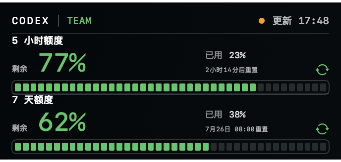
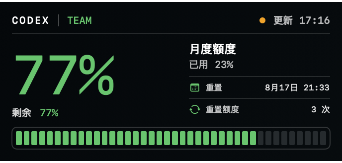

# Codex Balance Widget

> 一个原生 macOS WidgetKit 小组件，把 Codex 使用额度直接放到桌面上。

无需反复打开 Codex 或命令行查看额度。组件会自动识别当前账号返回的额度窗口，并根据真实计费周期显示剩余比例、已用比例和重置时间。





## 为什么做这个项目

Codex 的使用额度通常存在不同周期的限制，例如短周期窗口和更长周期窗口。真正影响使用体验的不是一个抽象的“总余额”，而是：

- 当前窗口还剩多少；
- 哪个窗口先触顶；
- 什么时候重置；
- 当前账号到底返回了几个真实额度窗口。

Codex Balance Widget 的目标就是把这些信息变成一个可以一直放在 macOS 桌面上的轻量状态卡片。

## 特点

- **原生 macOS WidgetKit**：不是网页、悬浮窗或 Electron 应用。
- **自动识别额度结构**：直接根据 Codex 返回的数据判断单窗口 / 双窗口及周期长度。
- **真实窗口独立显示**：不会把不同周期额度合并成一个虚假的总百分比。
- **显示剩余、已用和重置时间**：更适合判断当前是否还适合继续高强度使用 Codex。
- **后台自动刷新**：宿主应用无界面运行，每 10 分钟同步一次数据。
- **本地优先**：只把规范化后的额度数据写入 App Group，不复制或保存 Codex 登录令牌。
- **支持小号 / 中号 Widget**：适合桌面常驻。

## 支持的额度形态

### 双窗口账号

例如同时存在“5 小时额度 + 7 天额度”时，组件会按周期从短到长显示两条独立额度轨道。

### 单窗口账号

例如账号只返回一个月度或其他周期窗口时，组件会自动切换为单窗口大数字卡片，并根据实际周期命名。

### 其他周期组合

项目不会写死“5 小时 / 7 天 / 月度”三种模式，而是根据服务端返回的窗口数量和 `windowDurationMins` 自适应。

## 工作原理

1. 后台宿主在本机查找可用的 Codex 可执行文件。
2. 启动 `codex app-server --stdio`。
3. 调用实验性接口 `account/rateLimits/read`。
4. 读取当前账号返回的真实额度窗口、已用百分比和重置时间。
5. 将必要字段规范化后写入 App Group 共享容器。
6. WidgetKit 扩展读取快照并渲染桌面卡片。

> [!NOTE]
> 这是一个非官方开源项目，依赖本机 Codex 的实验性 `app-server` 接口。OpenAI / Codex 后续如果调整接口字段或调用方式，项目可能需要同步适配。

## 数据与隐私

组件只在本机处理额度状态。

写入共享容器的数据包括：

- 套餐名称；
- 已用百分比；
- 额度周期长度；
- 重置时间；
- 可用重置次数；
- 最近更新时间。

**Codex 登录令牌不会被写入 Widget 扩展或共享 JSON。**

## 环境要求

- macOS 14 或更高版本；
- Xcode 15 或更高版本；
- 已安装并登录 ChatGPT / Codex App，或本机存在可用的 Codex CLI；
- 一个可用于 App Group 签名的 Apple Developer Team。

## 构建与安装

1. Clone 本仓库：

   ```bash
   git clone https://github.com/tiandaoyouchang-png/codex-balance-widget.git
   cd codex-balance-widget
   ```

2. 用 Xcode 打开：

   ```bash
   open CodexBalance.xcodeproj
   ```

3. 在 `CodexBalance` 和 `CodexBalanceWidgetExtension` 两个 Target 中选择同一个 Signing Team。
4. 如果 Bundle ID 冲突，将两个 Bundle ID 改成你自己的唯一标识。
5. 运行 `CodexBalance` Scheme。
6. 在 macOS 桌面空白处右键 → **编辑小组件** → 搜索 **Codex 余额** → 添加。

项目使用：

```text
$(TeamIdentifierPrefix)codexbalance.shared
```

作为 App Group，因此两个 Target 必须使用同一个 Team 签名。

## Codex 可执行文件查找位置

当前会依次尝试：

```text
/Applications/ChatGPT.app/Contents/Resources/codex
/Applications/Codex.app/Contents/Resources/codex
/opt/homebrew/bin/codex
/usr/local/bin/codex
~/.hermes/node/bin/codex
```

如果你的 Codex 安装在其他位置，可以在 `App/CodexUsageService.swift` 中补充路径。

## 项目结构

```text
App/          后台宿主、本机 Codex 数据读取、共享快照写入
Widget/       WidgetKit 视图、额度状态布局、共享快照读取
References/   视觉参考
QA/           原生尺寸预览、实现对照图与 QA 工具
DESIGN.md     产品与视觉规范
design-qa.md  最终视觉还原检查
```

## 开源与贡献

项目使用 MIT License 开源。

欢迎提交 Issue、Bug 修复和 Pull Request。尤其欢迎一起适配：

- Codex `app-server` 接口变化；
- 新的额度周期或账号类型；
- Widget 视觉与信息层级优化；
- 更简单的安装与分发方式。

贡献前可先阅读 [CONTRIBUTING.md](CONTRIBUTING.md)。

## Roadmap

- [ ] 提供可直接下载的签名 Release；
- [ ] 增强异常状态与 Codex 未登录状态提示；
- [ ] 适配更多额度窗口返回格式；
- [ ] 增加更完整的安装与故障排查文档。

## Disclaimer

Codex Balance Widget 是社区非官方项目，与 OpenAI 无隶属、授权或背书关系。项目展示的数据完全取决于当前账号和本机 Codex 返回的内容。

## License

[MIT](LICENSE)
